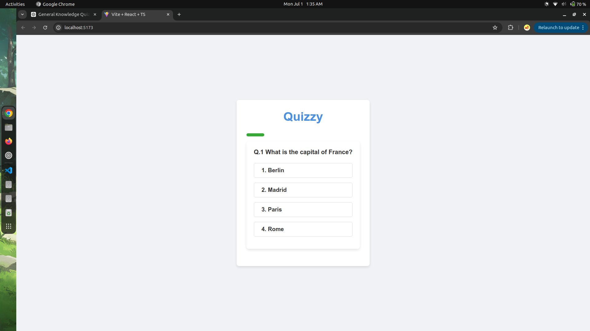
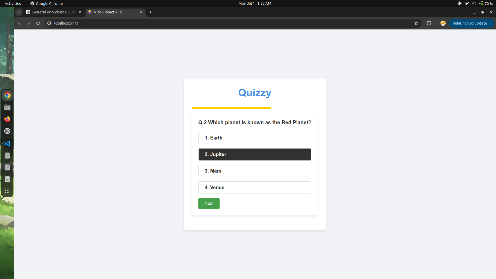
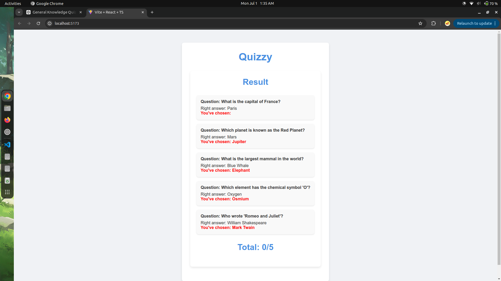

# Quizzy

Quizzy is a simple and interactive quiz application built with React and TypeScript. The project demonstrates how to create a dynamic quiz interface with timed questions, customizable styles, and a results summary.

## Table of Contents

- [Quizzy](#quizzy)
  - [Table of Contents](#table-of-contents)
  - [Features](#features)
  - [Installation](#installation)
  - [Usage](#usage)
    - [Key Files](#key-files)
  - [Customization](#customization)
  - [Screenshots](#screenshots)

## Features

- **React & TypeScript**: Built with modern web technologies.
- **Timed Questions**: Each question is timed, and a progress bar shows the remaining time.
- **Dynamic Styles**: Visually appealing and responsive design.
- **Results Summary**: Displays the correct and chosen answers with a total score at the end.

## Installation

1. Clone the repository:

```bash
git clone https://github.com/debrajroyofficial000/Quizzy.git
cd Quizzy
```

2. Install the dependencies:

```bash
npm install
```

3. Start the development server:

```bash
npm run dev
```

The application will be available at `http://localhost:5173`.

## Usage

- Navigate to the application in your browser.
- Answer each question within the given time.
- View your results at the end of the quiz.

### Key Files

- **`Question.tsx`**: Component for rendering individual questions and handling user interactions.
- **`Result.tsx`**: Component for displaying the quiz results.
- **`App.tsx`**: Main component that manages the quiz logic and state.
- **`App.css`**, **`Question.css`**, **`Result.css`**: Stylesheets for the respective components.

## Customization

You can customize the quiz questions and styles to fit your needs:

## Screenshots




